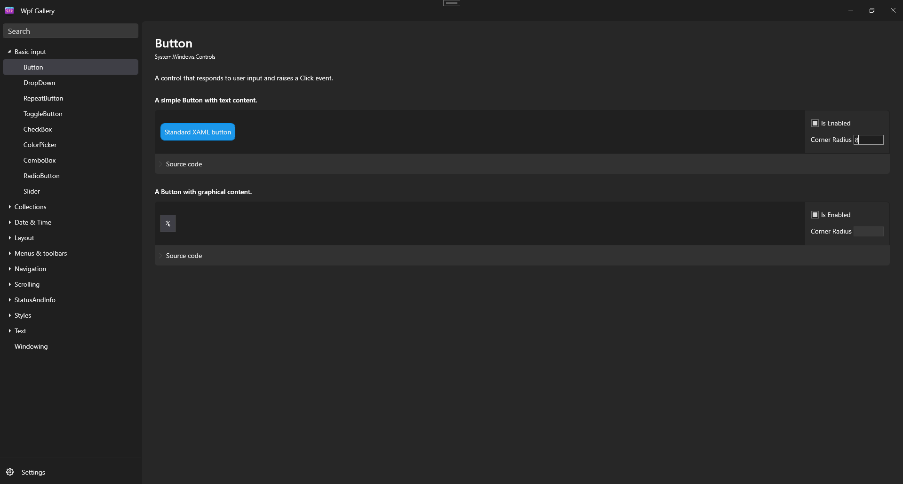

## DevToolbox

**DevToolbox** is a collection of custom controls and core logic designed to enhance your development experience across both WPF and WinUI applications. Currently in preview, this project will evolve with upcoming updates, including new controls and features to improve functionality and usability.

### Key Components

* **WPF Controls:** A diverse set of controls tailored for WPF applications.
* **WinUI Controls:** Parallel set of controls optimized for WinUI, leveraging the latest Windows app frameworks.
* **Core Logic Library:** Shared core functionality powering both WPF and WinUI implementations, promoting code reuse and consistency.

## Features

* **Variety of Controls:** Custom WPF and WinUI controls catering to different development needs.
* **Easy Integration:** Seamless integration with existing WPF and WinUI applications, ensuring minimal setup time.
* **Customizable Properties and Events:** Enhance control behavior through adjustable properties and event handlers for both platforms.
* **Theme Support:** Built-in support for light, dark, and high contrast themes, easily customizable for accessibility requirements.

## Demo Project

Explore the capabilities of the controls in the included demo projects:

* **WPF Demo:** Showcases WPF controls in action.
* **WinUI Demo:** Demonstrates WinUI controls usage.



## Future Plans

* **Performance Enhancements:** Updates to controls for improved performance across both WPF and WinUI.
* **New Controls:** Expanding the toolkit with additional platform-specific and shared controls.
* **User Feedback:** Continuous refinement based on user input and contributions.

## Installation

### Option 1: Using NuGet

Install the WPF and WinUI packages via NuGet:

```bash
Install-Package DevToolbox.Wpf
Install-Package DevToolbox.WinUI
```

### Option 2: Cloning the Repository

Clone the repository to work with the source code directly:

```bash
git clone https://github.com/gachris/DevToolbox.git
cd DevToolbox
```

Open the solution (`DevToolbox.sln`) in Visual Studio and build to compile the required libraries.

## Usage

Refer to the respective demo projects for practical examples on integrating and using the controls:

* **`Demo.Wpf`**
* **`Demo.WinUI`**

## Contributing

Contributions are welcome! If you have suggestions for improvements or new features, please open an issue or submit a pull request. Your input is invaluable for enhancing **DevToolbox** across both platforms.

## License

This project is licensed under the MIT License. See the [LICENSE](LICENSE.txt) file for more details.
